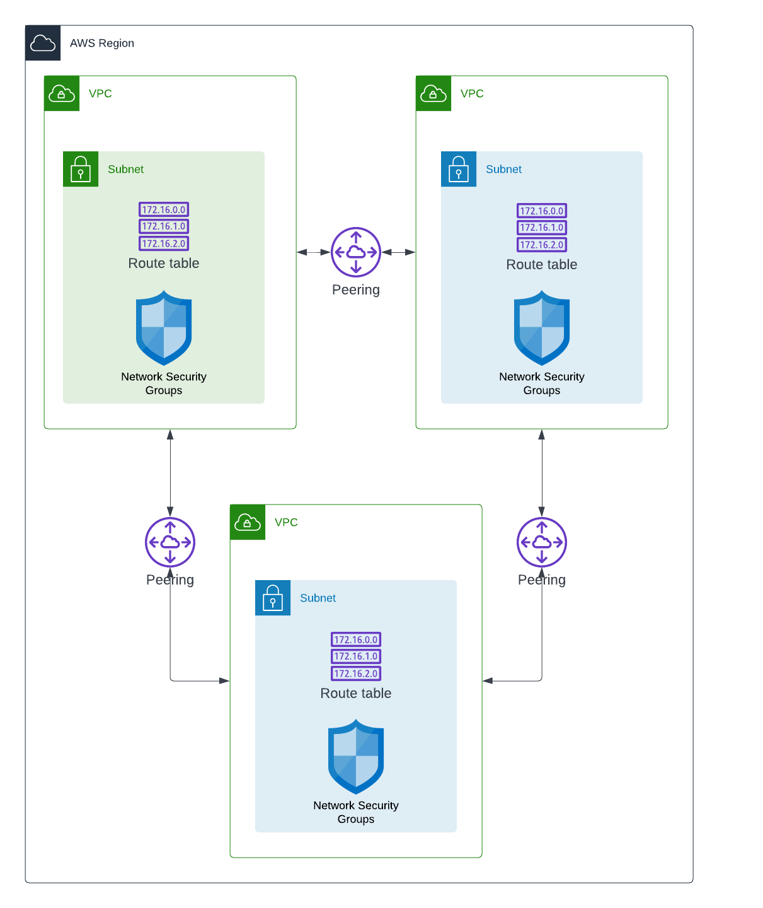

# Peer Existing Network Role

## Peering Networks

### Variables

The following variables are used during deployment and can be configured as extra vars at deploy time if you require something other than the defaults.

#### Required

```yaml
---
aws_region: us-east-1
peerings:
  - vpc_id: vpc-05bae6f9d123123
    peer_vpc_id: vpc-01db17418123123
```

#### Optional

```yaml

```

### Architecture Diagram

