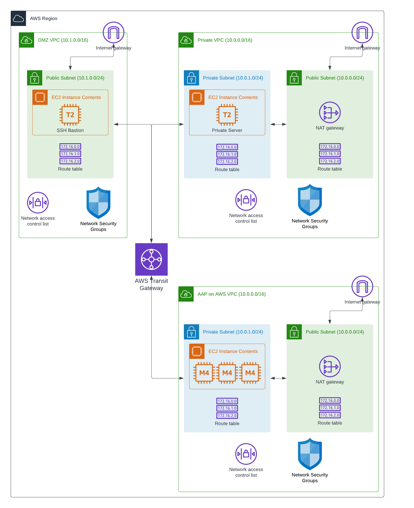

# Peer Transit Network Ansible Role

Peers a VPC into an AWS transit gateway and configures routing rules across all attached VPCs to allow traffic to the newly attached VPC.

## Peering Networks

When using this role, the following actions take place.

1. A VPC that you identify is peered into an existing AWS Transit Gateway in your AWS account.
2. Subnets in the VPC are attached to the Transit Gateway
3. Routing rules for each subnet attached to the Transit Gateway are updated to allow traffic between the different CIDR blocks of the attached VPCs.

### Variables

The following variables are used during the deployment.

| Variable             | Description                             |
|----------------------|-----------------------------------------|
|`aws_region`|The region in which the AWS operations will run.|
|`vpc_filters`|AWS filters used to find the VPC that you want to peer to the transit gateway, i.e. `"tag:aws:cloudformation:stack-name": AnsibleAWSStack`.|
|`transit_gateway_id`|The ID of the Transit Gateway that will manage peering.|
| `tg_attachment_name` | A name for the transit peer attachment. |

```yaml
---
aws_region: us-east-1
vpc_filters:
  "tag:aws:cloudformation:stack-name": AnsibleAWSStack
transit_gateway_id: tgw-0a3d56bd...
```

### Architecture Diagram


